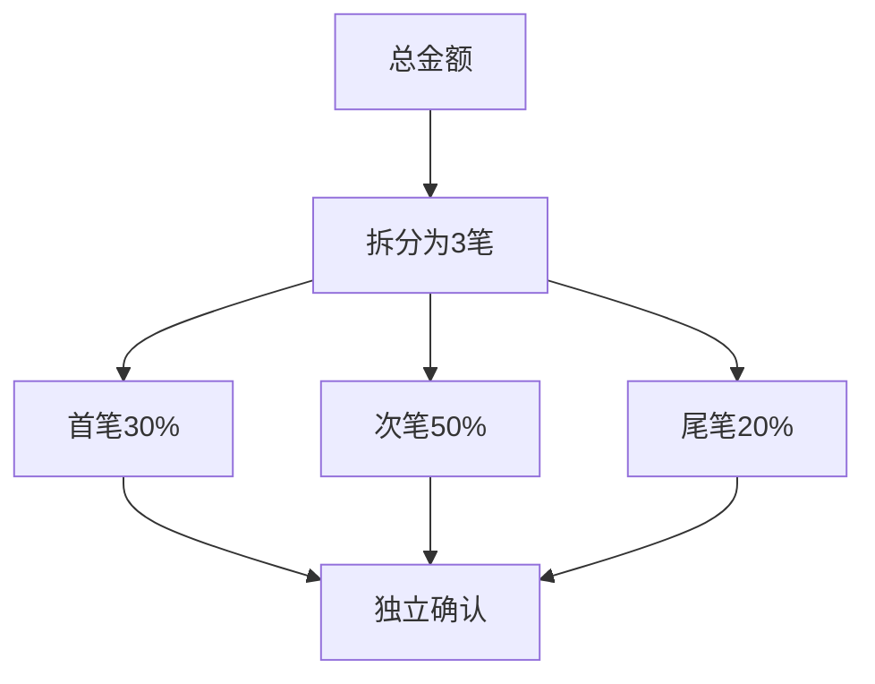
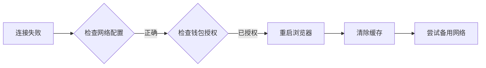

# 使用Synapse协议进行稳定币互换的完整指南

## 理解Synapse协议的核心优势

Synapse协议作为跨链稳定币互换领域的创新工具，凭借其独特的技术架构和功能优势，正在重塑数字资产流通方式。以下是其核心竞争力的深度解析：

### 多链生态兼容性

Synapse协议目前已实现对10+主流区块链网络的支持，涵盖：
- EVM兼容链：以太坊、Arbitrum、Optimism、Polygon、Avalanche
- 非EVM链：通过deBridge协议实现Solana跨链互通
- Layer2网络：Base、ZkSync等新兴扩展方案

这种广泛的兼容性使用户能够自由穿梭于不同生态，例如在以太坊获取高收益DeFi机会的同时，通过Polygon享受低手续费交易。

### 稳定币专项优化

协议专为稳定币设计的AMM模型具有以下优势：
- 极低滑点：0.1%以内的稳定币兑换滑点
- 高流动性池：累计处理超170亿美元交易量
- 动态费用机制：根据网络拥堵情况自动优化手续费

以百万级USDC跨链转移为例，Synapse相比传统桥接方案可节省约35%的综合成本，包括Gas费和价格滑点。

### 军事级安全防护体系

Synapse独创的多层安全架构包含：
- 分布式验证节点网络（21个独立验证者）
- 链下预言机数据校验机制
- 动态抵押品管理（总价值超5000万美元）

历史安全记录显示，协议成功抵御过包括重放攻击在内的多种网络威胁，资金锁定量（TVL）持续稳定增长。

## 跨链互换全流程指南

### 钱包准备与资产配置

推荐使用以下兼容钱包：
| 钱包名称 | 跨链支持 | 安全评级 |
|---------|----------|----------|
| MetaMask | 完全支持 | ★★★★☆ |
| Trust Wallet | 完全支持 | ★★★★ |
| Coinbase Wallet | 部分支持 | ★★★☆ |

资产配置建议：
1. 准备主网Gas费：预留0.5 ETH或等值稳定币
2. 分配桥接资金：建议单笔不低于1000 USDC
3. 多链资产分散：避免单一网络风险

### 跨链操作三步曲

1. **网络配置**  
   👉 [选择最优链路策略](https://bit.ly/okx_welcome)  
   在Synapse界面选择源链和目标链时，需参考：
   - 网络拥堵指数（通过Blockchair实时查询）
   - 交易确认速度（以太坊平均15秒，Polygon 2-3秒）
   - 跨链手续费对比表

2. **参数设置技巧**  
   高级参数调整建议：
   - 开启「自动Gas优化」功能
   - 设置滑点容忍度≤0.05%
   - 启用「交易回滚保护」

3. **执行与监控**  
   交易确认后可通过Synapse Explorer实时追踪：
   - 区块确认进度可视化
   - 跨链验证节点状态
   - 资产解锁倒计时

## 高级应用策略

### 机构级大额转账方案

针对百万美元级稳定币转移，推荐采用分批处理策略：

优势分析：
- 降低单笔交易对市场的影响
- 分散网络拥堵风险
- 实现更优Gas价格捕捉

### 成本优化组合策略

混合使用Synapse与DEX的套利方案：
1. 在Polygon以0.3 USDT/Gas买入USDC
2. 通过Synapse桥接至Avalanche
3. 在TraderJoe以AVAX-USTD池兑换
👉 [获取实时跨链收益计算器](https://bit.ly/okx_welcome)

实测数据显示，该策略可降低约28%的综合交易成本。

## 常见问题解决方案

### 交易延迟应急处理

当出现确认延迟时：
1. 首先检查源链区块浏览器确认数（建议≥12个）
2. 在Synapse仪表盘查看验证节点响应状态
3. 如超时30分钟，可申请人工干预（需支付100 USDC手续费）

### 钱包连接故障排查

典型问题处理流程：

### 滑点控制技巧

优化滑点的三大要素：
1. 选择流动性最高的稳定币对（USDC/USDT优先）
2. 避开加密市场剧烈波动时段（美东时间9-11AM）
3. 使用协议提供的「夜间模式」批量处理功能

## 未来技术演进

Synapse 3.0路线图重点包括：
- 零知识证明应用：实现跨链验证隐私保护
- 动态流动性池：根据实时需求自动调整资产配置
- 多签安全升级：引入阈值签名技术（TSS）

开发者社区数据显示，协议智能合约已通过CertiK和PeckShield双重审计，安全评级达到行业领先水平。

## 行业应用案例

某跨国电商结算系统改造：
- 原方案：通过SWIFT系统结算，耗时3天，手续费1.5%
- 新方案：Synapse跨链结算，耗时15分钟，手续费0.3%
- 年节约成本：约270万美元

👉 [获取企业级定制解决方案](https://bit.ly/okx_welcome)

## 常见问题解答（FAQ）

**Q：Synapse协议如何处理网络拥堵？**  
A：协议内置动态Gas优化器，可自动选择最优Gas价格，同时验证节点网络会动态扩容应对流量高峰。

**Q：非稳定币资产能否通过Synapse桥接？**  
A：当前主要支持稳定币，但通过合作协议可间接支持ETH等主流资产跨链。

**Q：交易失败时如何追回资金？**  
A：所有交易均设有超时回滚机制，若30分钟未确认将自动退还至原地址。

**Q：是否支持移动端操作？**  
A：推荐使用Trust Wallet移动端应用，已实现完整功能支持。

**Q：如何获取实时网络状态？**  
A：访问Synapse官方状态页面（status.synapseprotocol.com），可查看各链验证节点健康度。

**Q：协议升级如何影响现有交易？**  
A：采用热修复技术，升级期间已提交交易将继续执行，不受影响。

通过本指南的系统解析，用户可以全面掌握Synapse协议的核心价值与实战技巧。在数字资产跨链需求持续增长的今天，掌握这一工具将显著提升资产配置效率与收益。