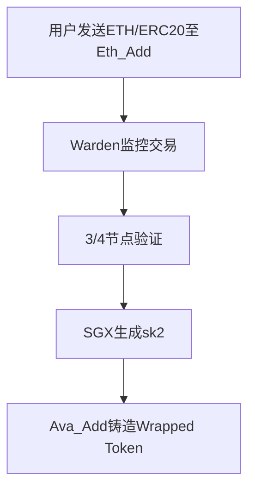
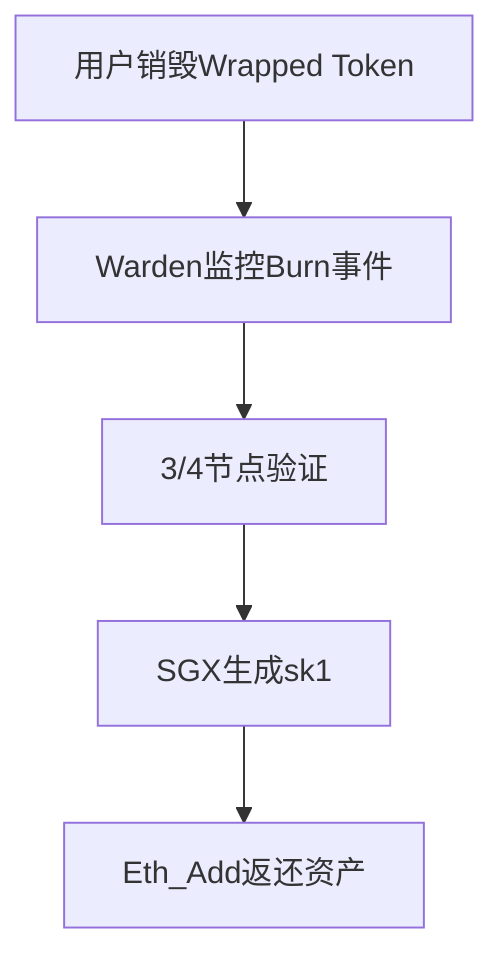

# Avalanche Bridge跨链桥技术解析与应用指南

## 一、跨链技术革新：Avalanche Bridge核心价值

在区块链技术发展进程中，跨链桥技术扮演着关键角色。Avalanche Bridge（AB）作为雪崩协议推出的第二代跨链解决方案，通过创新技术架构在安全性、效率与成本控制方面实现了突破性进展。其核心优势体现在：

1. **跨链速度提升**：双向跨链平均耗时6-9分钟
2. **费用优化**：跨链成本稳定在1-5美元区间
3. **资产支持**：涵盖WETH、ERC20代币及托管型WBTC

👉 [探索区块链创新技术](https://bit.ly/okx_welcome)

### 核心技术构成
- **Intel SGX可信执行环境**：硬件级安全保障
- **四节点Warden网络**：门限签名机制
- **双链地址管理**：非合约控制模式

## 二、技术架构深度解析

### 1. 跨链资金管理机制

AB采用独特的双地址管理模式，通过Intel SGX生成两个独立地址：

| 地址类型 | 区块链 | 功能定位 |
|---------|--------|---------|
| Eth_Add | Ethereum | 资金锁定 |
| Ava_Add | Avalanche | 资产铸造 |

Master Secret通过Shamir秘密共享算法拆分为4份，由四个Warden节点分别保管。系统重启需至少3个节点提交碎片才能重构密钥。

### 2. 信息验证流程

四节点Warden网络采用3/4门限共识机制：
- 节点构成：Ava Labs、Halborn、BwareLabs、Avascan
- 验证流程：监测→提交→共识→执行
- 安全保障：硬件级密钥隔离+多重签名验证

👉 [获取区块链安全解决方案](https://bit.ly/okx_welcome)

## 三、跨链操作全流程详解

### 方向一：Ethereum → Avalanche

### 方向二：Avalanche → Ethereum

## 四、性能与成本分析

### 跨链时间对比
| 阶段 | Ethereum | Avalanche | 总耗时 |
|------|----------|-----------|--------|
| 区块确认 | 6-7分钟 | 2-3秒 | 6-9分钟 |

### 费用结构解析
**Ethereum → Avalanche**
- 固定费用：约5美元
- 变动费用：交易Gas（用户承担）

**Avalanche → Ethereum**
- 费率：跨链代币价值的0.5%
- 最低收费：1美元

## 五、安全与去中心化评估

### 安全机制特性
- 硬件级隔离：Intel SGX确保密钥安全
- 多重验证：四节点3/4门限共识
- 风险控制：碎片化密钥管理

### 去中心化程度
- 透明度：公开Warden节点身份
- 可扩展性：支持后续节点扩展
- 折中方案：效率与安全的平衡设计

👉 [了解更多区块链安全技术](https://bit.ly/okx_welcome)

## 六、FAQ常见问题解答

**Q1：Avalanche Bridge与其他跨链方案的核心差异是什么？**
A：采用Intel SGX硬件级安全机制，配合四节点Warden网络，实现非合约管理的资产托管模式，兼顾效率与安全。

**Q2：跨链过程中资产安全如何保障？**
A：通过硬件级密钥隔离、碎片化存储、多节点共识三重防护，任何单一节点都无法单独控制资产。

**Q3：为什么选择四节点架构而非更多验证节点？**
A：雪崩协议在保证安全性的同时，优先考虑跨链效率。四节点架构可在保持99.9%容错率的前提下，将确认时间压缩至最小。

**Q4：如何应对Intel SGX的潜在漏洞风险？**
A：系统采用最新版SGX2技术，并配合动态密钥轮换机制。即使出现硬件漏洞，也需要同时攻破3个Warden节点才能造成威胁。

**Q5：跨链费用为何存在浮动？**
A：主要受Ethereum链上Gas价格影响。Avalanche侧收取固定服务费，具体数值会根据网络拥堵情况动态调整。

## 七、未来发展方向

1. **Warden节点扩展**：逐步开放社区节点加入
2. **多链支持**：扩展至其他主流公链