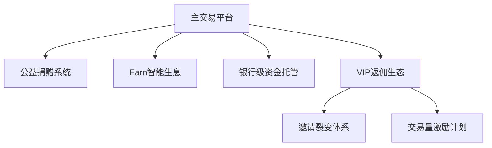

# Rybit交易所圣诞特惠：1,000 USDT每日生息体验金全攻略

## 交易所核心优势解读
Rybit交易所作为合规加密货币交易平台，已通过多项国际安全认证：
1. **资金安全保障**：与凯基银行合作建立新台币价金信托机制
2. **技术合规认证**：通过Wizlynx Group信息安全与反黑客系统检测
3. **反洗钱机制**：完成台湾金管会《洗钱防制法令遵循声明》报备
4. **交易创新模式**：独创台币直购USDT通道，有效规避滑点风险

> 2023年起每笔注册交易自动捐赠30元新台币至伊甸基金会象圈工程，实现科技与公益的双向赋能

## 圣诞特惠活动全解析

### 活动时间窗口
2023年12月21日启动至12月31日收官，为期11天的加密货币投资红利期

### 参与路径
1. **注册认证**：通过官方渠道完成KYC验证
2. **资金门槛**：单账户入金达100 USDT（约3,100-3,200新台币）
3. 👉 [极速参与通道](https://bit.ly/okx_welcome) 

### 核心权益
| 方案类型 | 存期周期 | 年化收益率 | 特色功能 |
|---------|----------|------------|----------|
| 基础方案 | 7天      | 约6%       | 每日复利 |
| 进阶方案 | 30天     | 约10%      | 复利增强 |

VIP用户专属加成：
- 额外获得1,500 USDT体验金
- 邀请返佣机制：30天期利息10%分成
- 交易量返佣：0.05% USDT/BTC/ETH交易奖励

## 加密货币投资新趋势

### Earn定存产品创新点
- **零风险试炼**：体验金机制降低投资门槛
- **复利效应可视化**：每日收益自动再投资
- **流动性管理**：灵活选择7日/30日存期

👉 [全球头部交易平台对比](https://bit.ly/okx_welcome)

### 公益科技融合实践
通过「买币即公益」功能模块，用户可实时追踪：
- 教育资源覆盖区域热力图
- 受助学童在线学习时长
- 公益资金使用明细公示

## 常见问题解答

Q：体验金发放时效需要多久？
A：基础活动奖励于活动结束后10个工作日内到账，VIP方案奖励在银行绑定后3个工作日内发放

Q：如何同时获取双重复合权益？
A：需在注册时填写官方活动表单，完成银行绑定并达到交易量要求即可激活全部奖励

Q：收益计算是否包含本金？
A：体验金独立计算收益，实际收益受市场利率波动影响，历史年化收益保持6%-10%区间

Q：资金赎回规则是怎样的？
A：支持到期自动赎回，7日方案可灵活应对市场波动，30日方案建议持有完整周期获取最佳收益

## 投资策略建议

### 风险对冲方案
1. **阶梯投资法**：将资金拆分为7日/30日组合
2. **复利加速器**：每日收益再投资倍增效应测算：
   - 本金1,000 USDT连续复利30天增值约8.3%
3. 👉 [专业投资计算器工具](https://bit.ly/okx_welcome)

### 市场波动应对
- 设置动态止盈线（建议年化收益达8%时部分赎回）
- 关注美联储利率政策调整窗口期
- 跨平台套利机会监测（现货/合约价差）

## 行业标杆实践

Rybit交易所创新生态矩阵：

2023年度社会责任报告显示：
- 累计公益投入突破420万新台币
- 用户资产托管规模年增300%
- 平台安全运行天数达1095天

👉 [加密货币投资白皮书下载](https://bit.ly/okx_welcome)