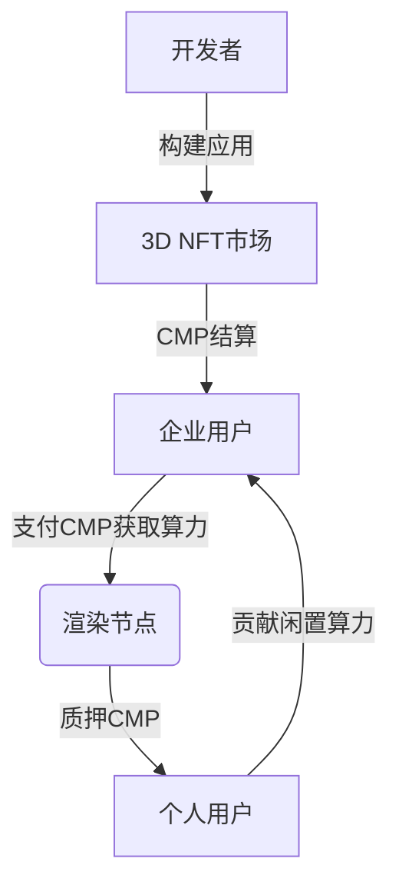

# 以太坊合并前夜的算力转型与元宇宙新机遇

## PoW生态面临的转型挑战

以太坊向PoS机制的迁移正在引发行业巨变。随着合并进程的推进，全球超过50万GPU矿机面临转型困境。目前ETC与ETH算力比为1:37，但其网络容量难以承载庞大的算力迁移，过长的回本周期与双花攻击风险使单纯转向ETC并非长久之计。

👉 [深入了解以太坊合并最新进展](https://bit.ly/okx_welcome)

### 算力价值重构的迫切需求
传统PoW公链生态存在算力资源单一化问题，当前能源消耗模式难以获得市场认可。据统计，全球以太坊矿机年耗电量相当于挪威全国用电量，这种资源消耗亟需转化为可持续的应用场景。

## 元宇宙带来的算力新机遇

元宇宙的虚实融合特性为PoW算力开辟了全新赛道。GPU矿机在以下核心场景具有战略价值：

1. **实时渲染需求**：元宇宙场景中每秒需要处理超过10亿个光线追踪计算
2. **边缘计算部署**：用户设备与云端之间的算力协同需求增长300%
3. **分布式存储**：三维模型数据存储需求呈现指数级增长

### 边缘计算与渲染技术的突破

| 技术方案        | 中心化处理时间 | 边缘处理时间 | 效率提升倍数 |
|-----------------|----------------|--------------|--------------|
| 离线渲染(1G项目)| 760秒          | 79秒         | 9.62倍       |
| 实时交互场景    | 200ms延迟      | 20ms延迟     | 10倍         |

边缘计算通过分布式节点部署，将渲染效率提升至传统模式的10倍以上，同时降低带宽成本40%。

## Caduceus：去中心化渲染协议的实践

作为元宇宙基础设施的创新代表，Caduceus构建了完整的算力价值闭环：

### 核心技术创新
- **混合共识机制**：PoW+PoS双链架构保障算力公平分配
- **分布式GPU池化**：全球节点共享超20万块高端显卡资源
- **智能调度系统**：动态匹配算力需求，资源利用率提升65%

👉 [探索Caduceus生态最新动态](https://bit.ly/okx_welcome)

### 生态价值体系
CMP代币作为核心媒介，构建了多方共赢的经济模型：

## 矿工转型路径分析

以太坊矿工可通过三种模式实现平滑过渡：

1. **硬件迁移**：直接接入Caduceus算力网络，设备适配周期＜72小时
2. **算力租赁**：将矿机转为云算力节点，收益稳定性提升50%
3. **生态共建**：参与节点质押，获取CMP通胀奖励与交易手续费分成

👉 [获取矿机迁移技术指南](https://bit.ly/okx_welcome)

### FAQ：矿工转型常见问题

**Q：现有矿机如何适配新生态？**  
A：Caduceus支持NVIDIA RTX 30/40系显卡即插即用，AMD显卡适配将于Q3完成

**Q：转型成本需要多少？**  
A：硬件迁移零成本，仅需支付约500美元节点部署费即可加入生态

**Q：CMP代币收益如何保障？**  
A：协议设定年通胀率12%，优先分配给算力贡献者，质押年化收益约18-25%

## 行业发展趋势展望

随着元宇宙市场规模突破8万亿美元，算力需求呈现三大趋势：
1. **异构计算**：GPU/FPGA/ASIC混合算力需求年增60%
2. **分布式云**：边缘节点数量预计2025年达500万个
3. **算力证券化**：算力期货交易量已突破100亿美元

以太坊的PoS转型虽改变行业格局，但通过元宇宙等创新场景的开拓，PoW算力正实现从能源消耗到价值创造的质变。正如Caduceus展现的生态潜力，算力资源的去中心化调度与高效利用，或将开启Web3.0时代的新篇章。