# 如何联系欧易官网客服：解决问题的快捷方式

## 多渠道客服体系解析

作为全球领先的加密货币交易平台，欧易（OKX）建立了完善的客户支持体系。本文将系统解析平台提供的五大核心客服渠道，帮助用户快速定位最适合的沟通方式。

### 在线客服：实时互动首选
欧易官网与移动端应用均内置智能客服系统，用户可通过页面右下角悬浮按钮直接接入人工客服。该渠道具有三大优势：
1. **即时响应**：平均响应时间小于30秒
2. **智能分流**：AI客服预处理常见问题
3. **会话记录同步**：支持跨设备查看历史沟通记录

👉 [立即体验高效客服支持](https://bit.ly/okx_welcome)

#### 使用技巧：
- 工作日上午9-11点为客服响应高峰期
- 复杂问题建议附上账户截图（需隐去敏感信息）
- 使用[官方APP](https://bit.ly/okx_welcomedownload)可获得专属快捷入口

### 邮件支持：正式沟通渠道
对于需书面凭证的事务（如账户申诉、异常交易核查），推荐使用官方客服邮箱 **[support@okx.com](mailto:support@okx.com)**。标准处理流程如下：

| 邮件类型 | 预计响应时间 | 建议提交材料 |
|---------|-------------|------------|
| 账户安全类 | 2小时内加急 | 身份证扫描件、操作截图 |
| 交易纠纷类 | 24小时内 | 交易订单号、聊天记录 |
| 常规咨询类 | 48小时内 | 问题描述文档 |

### 社交媒体矩阵
欧易建立了覆盖全球的社交媒体支持网络，各平台功能定位明确：

**Twitter（@OKX）**
- 最新技术公告发布
- 紧急事件官方声明
- 单日处理超5000条咨询

**Telegram官方频道**
- 中文用户群组：@OKX_China_Official
- 英文主频道：@OKX_Official
- 定期AMA（问答互动）活动

**微信/微博**
- 提供7×12小时智能客服
- 微信公众号推送安全提示
- 微博实时更新风控公告

### 自助服务系统
欧易官网FAQ中心包含超过2000个标准问题解答，覆盖以下核心模块：

1. **账户管理**
   - 两步验证设置指南
   - 子账户权限配置
   - 身份认证升级流程

2. **交易操作**
   - 杠杆交易风险控制
   - 合约强平计算规则
   - 跨链转账操作手册

3. **资金安全**
   - 冷钱包存储机制解析
   - 异常登录监控系统
   - 资金划转风控策略

### 服务时效说明
欧易客服团队实行7×24小时轮班制，不同渠道响应时效存在差异：

```mermaid
gantt
    title 客服渠道响应时效对比
    dateFormat  HH:mm
    axisFormat  %H:%M
    
    在线客服       :a1, 00:00, 24h
    邮件支持       :a2, 02:00, 48h
    社交媒体       :a3, 01:00, 24h
    电话咨询       :a4, 00:30, 24h
```

## 常见问题解答（FAQ）

**Q：客服响应时间受哪些因素影响？**  
A：主要受问题复杂度、提交时间、材料完整性三方面影响。建议在提交咨询时：
1. 详细描述问题发生时间
2. 提供清晰的操作截图
3. 标注账户ID末四位

**Q：如何处理客服未及时响应的情况？**  
A：可采取以下升级措施：
1. 通过不同渠道重复提交（需注明"URGENT"）
2. 使用[官方反馈系统](https://bit.ly/okx_welcomefeedback)
3. 联系VIP专属顾问（需达到VIP2及以上等级）

**Q：邮件咨询未收到回复怎么办？**  
A：请检查：
1. 垃圾邮件文件夹
2. 提交时间是否超过72小时
3. 邮件主题是否包含关键信息
若仍未收到回复，可通过在线客服系统查询工单编号。

## 服务优化建议

根据2024年Q2用户满意度调查显示，结合不同场景推荐如下沟通策略：

| 使用场景 | 推荐渠道 | 成功率 | 耗时预估 |
|---------|---------|-------|---------|
| 账户被锁 | 在线客服+邮件 | 98% | 15-30分钟 |
| 提现异常 | 在线客服上传凭证 | 95% | 即时处理 |
| 合约强平争议 | 邮件申诉 | 87% | 24-48小时 |
| 系统故障报告 | Twitter+Telegram | 92% | 实时更新 |

## 投诉升级机制

当常规渠道未能解决问题时，可启动三级投诉流程：
1. **初级投诉**：通过官网反馈系统提交
2. **中级申诉**：发送至高级客服邮箱 **[senior_support@okx.com](mailto:senior_support@okx.com)**
3. **最终仲裁**：联系新加坡金融纠纷调解中心（FDRC）

👉 [查看完整投诉流程指南](https://bit.ly/okx_welcome)

## 安全提示
请务必通过以下方式验证客服身份：
1. 官方邮箱后缀统一为@okx.com
2. 线下活动需查验工作人员电子工牌
3. 所有客服不会索取账户密码

通过合理选择沟通渠道并配合完整信息，可将问题解决效率提升60%以上。建议用户提前完成[高级身份认证](https://bit.ly/okx_welcomeidentity-verification)，以获取更高等级的客服优先权限。