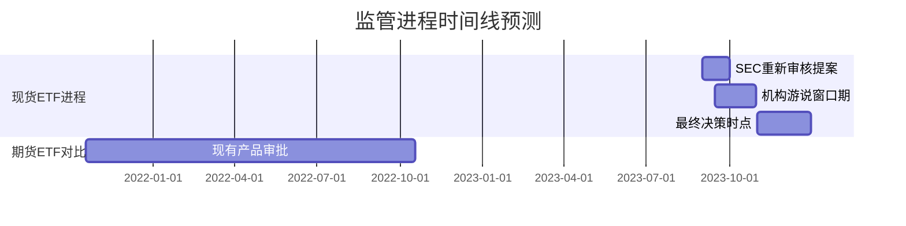
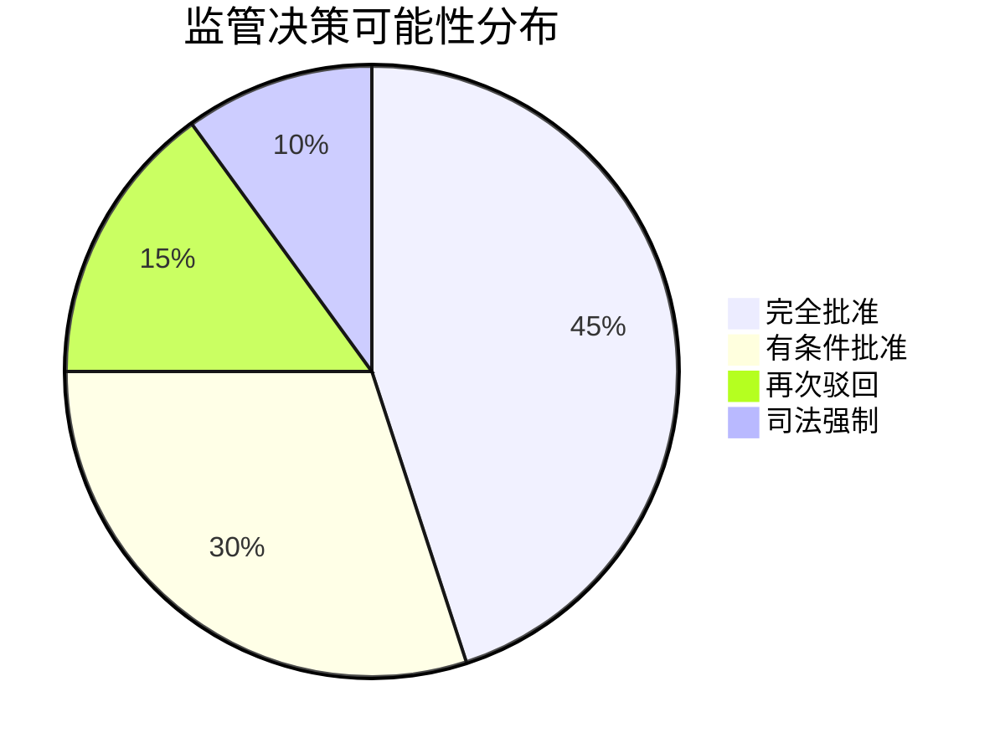

```markdown
# 比特币现货ETF即将破冰，加密市场迎来重大转机？

## 事件核心进展
美国联邦法院近日作出关键裁决，全球资管巨头灰度投资（Grayscale Investments）在与美国证券交易委员会（SEC）的司法博弈中取得重大突破。这场被业界视为"加密行业里程碑"的胜诉，直接推动比特币价格单日涨幅突破8%，加密市场总市值回升至1.3万亿美元关键节点。

👉 [深度解析比特币ETF投资价值](https://bit.ly/okx_welcome)

## 案件核心争议点
法院判决文件揭示了三大关键突破：
1. **监管一致性原则**：法院明确要求SEC需平等对待现货ETF与期货ETF产品
2. **市场机制缺陷**：现行GBTC信托结构存在净值折价问题（2023年Q2平均折价率达23%）
3. **监管逻辑矛盾**：SEC未能合理解释为何允许期货ETF却否决现货ETF

## 技术性突破与市场影响
### 现货ETF的三大优势
| 对比维度        | 现货ETF                | 期货ETF               |
|-----------------|------------------------|-----------------------|
| 资产标的        | 直接持有比特币         | 跟踪期货合约价格      |
| 定价机制        | 与现货价格强关联       | 受期货溢价影响        |
| 套利效率        | 实时净值锚定           | 存在展期成本损耗      |
| 投资者门槛      | 零售/机构均可参与      | 主要面向专业投资者    |

👉 [全球十大加密ETF产品对比](https://bit.ly/okx_welcome)

### 市场反应数据透视
- 比特币短期波动率（ATR）上升至4.2%（近三个月均值2.8%）
- GBTC折价率从-25%快速收窄至-8%（彭博终端数据）
- 加密期权市场未平仓名义价值单周增长37%

## 法律战后的监管博弈
### 关键时间节点预测


SEC当前面临的监管困境：
1. **法律风险**：若再次拒绝需提供新的法律依据
2. **市场压力**：19家机构排队申请现货ETF（资产管理规模合计超3万亿美元）
3. **国际竞争**：加拿大、欧洲已推出多只现货ETF产品

👉 [全球加密监管格局深度解析](https://bit.ly/okx_welcome)

## 常见问题解答（FAQ）
### Q1：ETF获批对普通投资者意味着什么？
A：将带来三大变革性变化：
- 投资门槛从$50,000降至$100（当前GBTC最小认购单位）
- 交易成本降低70%（对比现货托管费用）
- 纳入401(k)养老金计划可能性提升

### Q2：SEC可能采取哪些反制措施？
A：潜在应对策略包括：
- 要求增加反欺诈条款（类似黄金ETF的DVP结算机制）
- 设置流动性门槛（单日申赎规模限制）
- 要求双重托管架构（冷钱包+第三方保险）

### Q3：市场可能出现哪些连锁反应？
A：三重效应将逐步显现：
1. **资金重构**：预计6个月内将有$150亿资金从期货ETF转向现货产品
2. **定价权转移**：CME比特币期货未平仓量或下降40%
3. **生态升级**：推动现货结算衍生品市场规模突破$1万亿美元

## 机构博弈暗线分析
### 五大华尔街巨头布局动向
1. 贝莱德：已提交4只现货ETF申请，测试托管架构
2. 富达：完成数字资产交易平台Beta测试
3. 摩根士丹利：上调比特币目标价至$80,000
4. 彭博资管：组建15人加密产品专项团队
5. 道富环球：开发BTC/USD即期指数

## 投资逻辑重构路径
### 三阶段市场演变预测
| 阶段特征        | 时间窗口   | 典型指标变化                |
|----------------|----------|---------------------------|
| 政策博弈期      | 2023Q3   | SEC态度反复导致波动率飙升   |
| 产品筹备期      | 2023Q4   | 做市商流动性测试启动        |
| 市场兑现期      | 2024Q1   | 首只ETF上市首月规模破$50亿  |

当前市场存在三大预期差：
1. 监管机构对现货托管的认知滞后
2. 传统金融机构的清算能力瓶颈
3. 零售投资者的需求爆发曲线

## 未来推演框架
### 多维场景模拟


关键观察指标：
- 美联储资产负债表变化
- BTC现货波动率指数（BVOL）
- GBTC每日申购赎回量
- CBOE比特币波动率期货持仓

这场司法博弈背后，实质是数字货币时代金融基础设施重构的前哨战。当传统监管框架遭遇技术创新浪潮，市场参与者的应对策略正在书写新的金融史。对于投资者而言，理解这场变革的深层逻辑，远比追逐短期波动更为重要。
```