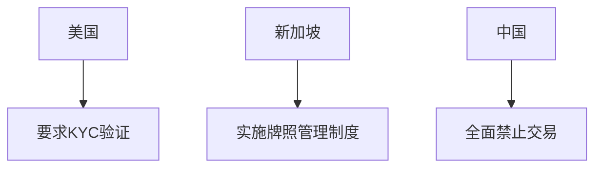

# 迷因币的双重特性：值得投资吗？

## 什么是迷因币及其流行原因

### 迷因币的核心定义  
迷因币是依托网络迷因文化诞生的加密货币，通常以搞笑表情包或流行文化符号为载体。**Dogecoin**、**Shiba Inu**和**Wall Street Pepe**等代表项目，通过社区自组织传播实现指数级增长。其底层逻辑是利用群体情绪制造稀缺性认知，形成社交货币属性。

👉 [探索迷因币投资潜力](https://bit.ly/okx_welcome)  

### 病毒式传播的三大引擎  
1. **社交裂变机制**：Twitter话题标签、Reddit社区讨论形成传播闭环  
2. **意见领袖背书**：马斯克等科技巨头的推文可直接引发20%以上的价格波动  
3. **FOMO心理驱动**：散户投资者在「错失暴富机会」焦虑下跟风入场  

## Wall Street Pepe的投资价值分析

### 现象级社区经济模型  
Wall Street Pepe（WEPE）依托Reddit WallStreetBets论坛的反抗传统金融叙事，其预售阶段筹集的$36.2M资金创造了新型众筹范式。该项目通过DAO治理机制赋予持有者投票权，形成去中心化决策体系。

### 高波动性下的收益图谱  
历史数据显示，优质迷因币可实现10-100倍收益，但需满足三个条件：  
| 条件要素 | 具体表现 |  
|---------|----------|  
| 社区活跃度 | 每日新增钱包地址增长>5% |  
| 流动性池规模 | 总锁仓量突破$50M |  
| 媒体曝光度 | 主流财经媒体每月报道≥3次 |  

## 投资风险全景透视

### 价格波动的蝴蝶效应  
2021年Dogecoin单日最大跌幅达35%，这种极端波动源于：  
- **流动性陷阱**：做市商撤单引发链式抛压  
- **算法操控风险**：部分项目方通过机器人制造虚假交易量  
- **监管信号敏感**：SEC政策变动可导致市值瞬间蒸发  

### 监管沙盒的边界探索  
全球主要司法管辖区对迷因币的监管态度呈现两极分化：  

## 预售成功对项目生命周期的影响

### 资金使用的黄金比例  
成功预售的项目应遵循「3331」资金分配法则：  
- 30%用于技术开发与安全审计  
- 30%建立流动性做市基金  
- 30%开展全球社区建设  
- 10%储备应对监管变动  

### 市场预期管理策略  
项目方可通过以下工具维持价格稳定：  
1. **动态销毁机制**：设置1%的每笔交易销毁比例  
2. **质押收益调节**：根据流通量自动调整年化收益率  
3. **NFT生态绑定**：发行限量版数字藏品提升持有价值  

## 稳定币的差异化战略价值

### 跨境支付场景实证  
Tether（USDT）在东南亚电商结算中的使用率已达68%，其优势体现在：  
- 交易成本降低至传统SWIFT的1/20  
- 结算时间从3天压缩至15分钟  
- 汇率波动损失控制在0.3%以内  

👉 [了解稳定币应用场景](https://bit.ly/okx_welcome)  

### 监管沙盒的突围路径  
合规稳定币发行方需构建三重防御体系：  
1. **储备金审计**：每日链上披露美元储备比例  
2. **交易监控**：部署AI反洗钱识别系统  
3. **司法管辖适配**：建立多辖区法律响应团队  

## FAQ投资决策指南  

**Q：新手投资者如何评估迷因币项目质量？**  
A：建议采用「3W筛选法」：Whitepaper详实度、Wallet分布集中度、Whale持仓变化度  

**Q：持有迷因币应配置多少仓位？**  
A：激进型投资者可设5%-10%上限，保守型投资者建议控制在2%以下  

**Q：如何识别迷因币市场的泡沫信号？**  
A：重点关注TVL/交易量比值，当该指标跌破0.1时预示流动性危机  

**Q：稳定币是否完全无风险？**  
A：需警惕脱锚风险，建议选择有实际资产抵押的合规稳定币  

**Q：监管政策变化如何影响投资决策？**  
A：建立政策预警系统，重点关注美联储利率决议和G20加密货币峰会  

## 未来投资框架构建

在数字资产配置矩阵中，建议采用「双轨制」投资策略：  
1. **核心仓位**（60%）：配置合规稳定币和DeFi龙头项目  
2. **卫星仓位**（40%）：参与优质迷因币的流动性挖矿  

👉 [获取专业投资组合方案](https://bit.ly/okx_welcome)  

通过动态平衡高波动资产与稳定资产的比例，投资者可构建具备抗风险能力的加密货币投资组合。在保持对新兴叙事关注的同时，需建立严格的止损机制和流动性储备，方能在数字经济的新赛道中稳健前行。